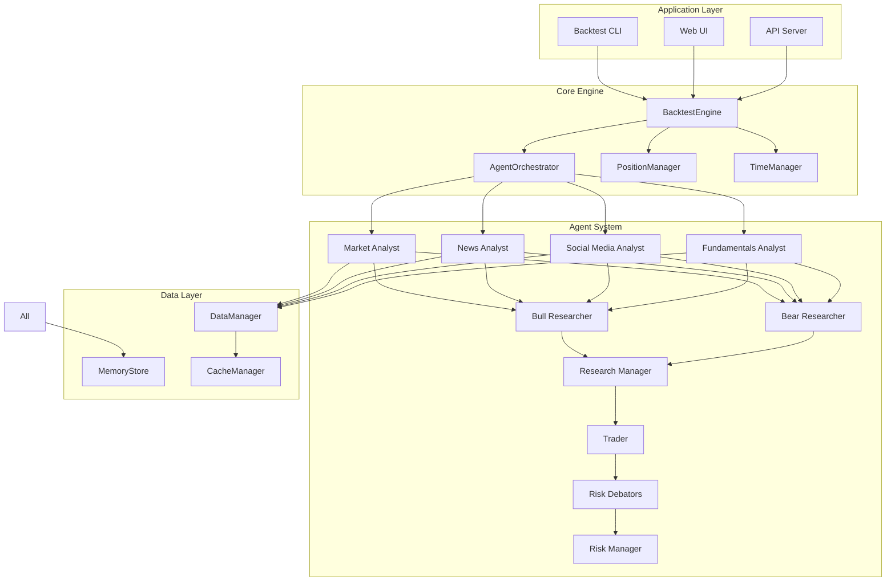
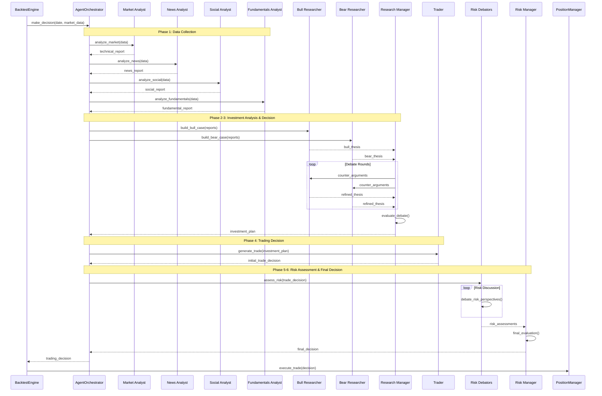

# TradingAgents2 バックテスト機能 詳細設計書

## 1. システムアーキテクチャ

### 1.1 全体構成

```
┌─────────────────────────────────────────────────────────────────┐
│                        Application Layer                          │
├─────────────────────────────────────────────────────────────────┤
│  BacktestCLI  │  WebUI  │  API Server  │  Jupyter Interface     │
└────────┬───────────────────────────────────────────────────────┘
         │
┌────────▼───────────────────────────────────────────────────────┐
│                      Orchestration Layer                         │
├─────────────────────────────────────────────────────────────────┤
│         BacktestEngine        │        AgentOrchestrator        │
│  ┌────────────────────────┐  │  ┌───────────────────────────┐ │
│  │ • Simulation Control    │  │  │ • Agent Coordination      │ │
│  │ • Time Management       │  │  │ • Message Routing         │ │
│  │ • Position Tracking     │  │  │ • Decision Flow Control   │ │
│  └────────────────────────┘  │  └───────────────────────────┘ │
└────────┬───────────────────────────────────────────────────────┘
         │
┌────────▼───────────────────────────────────────────────────────┐
│                        Agent Layer                               │
├─────────────────────────────────────────────────────────────────┤
│ Analysts │ Researchers │ Risk Debators │ Managers │ Trader     │
└────────┬───────────────────────────────────────────────────────┘
         │
┌────────▼───────────────────────────────────────────────────────┐
│                      Data Access Layer                           │
├─────────────────────────────────────────────────────────────────┤
│  DataManager  │  MemoryStore  │  CacheManager  │  APIClients   │
└────────┬───────────────────────────────────────────────────────┘
         │
┌────────▼───────────────────────────────────────────────────────┐
│                     Infrastructure Layer                         │
├─────────────────────────────────────────────────────────────────┤
│   Database   │   File System   │   Message Queue   │   Logger   │
└─────────────────────────────────────────────────────────────────┘
```

### 1.2 コンポーネント間の関係



## 2. 詳細クラス設計

### 2.1 BacktestEngine クラス

```python
class BacktestEngine:
    """バックテストシミュレーションの中核エンジン"""
    
    def __init__(self, config: BacktestConfig):
        self.config = config
        self.time_manager = TimeManager(config.start_date, config.end_date)
        self.position_manager = PositionManager(config.initial_capital)
        self.agent_orchestrator = AgentOrchestrator(config.agent_config)
        self.data_manager = DataManager(config.data_config)
        self.memory_store = MemoryStore()
        self.metrics_calculator = MetricsCalculator()
        self.logger = BacktestLogger()
        
    async def run(self) -> BacktestResult:
        """バックテストの実行"""
        # 初期化
        await self._initialize()
        
        # メインループ
        while self.time_manager.has_next():
            current_date = self.time_manager.current_date
            
            # データ取得
            market_data = await self.data_manager.get_data(current_date)
            
            # エージェント判断
            decision = await self.agent_orchestrator.make_decision(
                date=current_date,
                market_data=market_data,
                portfolio=self.position_manager.get_portfolio_state()
            )
            
            # 取引実行
            if decision.action != TradeAction.HOLD:
                await self._execute_trade(decision)
            
            # ポートフォリオ更新
            self.position_manager.update_portfolio_value(market_data)
            
            # メモリ更新
            await self._update_memory(decision)
            
            # 次の日へ
            self.time_manager.next()
            
        # 結果集計
        return self._calculate_results()
```

### 2.2 AgentOrchestrator クラス

```python
class AgentOrchestrator:
    """エージェント間の協調を管理"""
    
    def __init__(self, config: AgentConfig):
        self.config = config
        self.agents = self._initialize_agents()
        self.decision_flow = DecisionFlow()
        
    async def make_decision(
        self,
        date: datetime,
        market_data: MarketData,
        portfolio: PortfolioState
    ) -> TradingDecision:
        """エージェント協調による取引判断"""
        
        # Phase 1: データ収集
        analyst_reports = await self._data_collection_phase(date, market_data)
        
        # Phase 2: 投資分析
        investment_thesis = await self._investment_analysis_phase(analyst_reports)
        
        # Phase 3: 投資判断
        investment_plan = await self._investment_decision_phase(investment_thesis)
        
        # Phase 4: 取引決定
        initial_trade = await self._trading_decision_phase(investment_plan, portfolio)
        
        # Phase 5: リスク評価
        risk_assessment = await self._risk_assessment_phase(initial_trade, portfolio)
        
        # Phase 6: 最終決定
        final_decision = await self._final_decision_phase(risk_assessment)
        
        return final_decision
```

### 2.3 エージェント基底クラス

```python
class BaseAgent(ABC):
    """全エージェントの基底クラス"""
    
    def __init__(self, name: str, llm_config: LLMConfig, memory: AgentMemory):
        self.name = name
        self.llm = self._create_llm(llm_config)
        self.memory = memory
        self.logger = AgentLogger(name)
        
    @abstractmethod
    async def process(self, input_data: Dict[str, Any]) -> AgentOutput:
        """エージェント固有の処理"""
        pass
        
    async def reflect(self, outcome: TradingOutcome) -> None:
        """取引結果に基づく振り返り"""
        reflection = await self._generate_reflection(outcome)
        self.memory.add_reflection(reflection)
        
    def _create_llm(self, config: LLMConfig) -> LLM:
        """LLMインスタンスの作成"""
        if config.use_deep_thinking:
            return DeepThinkLLM(config)  # o1-preview相当
        else:
            return QuickThinkLLM(config)  # gpt-4o相当
```

### 2.4 PositionManager クラス

```python
class PositionManager:
    """ポジション管理とリスク制御"""
    
    def __init__(self, initial_capital: float):
        self.initial_capital = initial_capital
        self.cash = initial_capital
        self.positions: Dict[str, Position] = {}
        self.transaction_history: List[Transaction] = []
        
    def calculate_position_size(
        self,
        signal: TradingSignal,
        risk_profile: RiskProfile,
        confidence: float
    ) -> float:
        """段階的ポジションサイジングの計算"""
        
        # リスクプロファイル別の上限
        max_allocation = {
            RiskProfile.AGGRESSIVE: 0.8,
            RiskProfile.NEUTRAL: 0.5,
            RiskProfile.CONSERVATIVE: 0.3
        }[risk_profile]
        
        # 信頼度による調整
        if confidence >= 0.8:
            size_multiplier = 1.0
        elif confidence >= 0.5:
            size_multiplier = 0.7
        else:
            size_multiplier = 0.4
            
        # 利用可能資本の計算
        available_capital = self._calculate_available_capital()
        
        # ポジションサイズの決定
        base_size = available_capital * max_allocation * size_multiplier
        
        # 制約の適用
        return self._apply_constraints(base_size, signal)
```

### 2.5 DataManager クラス

```python
class DataManager:
    """データ取得と時間整合性管理"""
    
    def __init__(self, config: DataConfig):
        self.config = config
        self.cache_manager = CacheManager()
        self.api_clients = self._initialize_api_clients()
        self.timezone = pytz.UTC
        
    async def get_data(self, date: datetime) -> MarketData:
        """指定日のマーケットデータ取得"""
        
        # キャッシュチェック
        cached_data = await self.cache_manager.get(date)
        if cached_data and not self.config.force_refresh:
            return cached_data
            
        # データ取得（厳密な順序制御）
        async with self._ensure_deterministic_order():
            price_data = await self._get_price_data(date)
            news_data = await self._get_news_data(date)
            fundamental_data = await self._get_fundamental_data(date)
            technical_data = await self._calculate_technical_indicators(price_data)
            
        # ルックアヘッドバイアスチェック
        self._validate_temporal_consistency(date, price_data, news_data, fundamental_data)
        
        market_data = MarketData(
            date=date,
            prices=price_data,
            news=news_data,
            fundamentals=fundamental_data,
            technicals=technical_data
        )
        
        # キャッシュ保存
        await self.cache_manager.save(date, market_data)
        
        return market_data
```

### 2.6 MemoryStore クラス

```python
class MemoryStore:
    """エージェントメモリと学習機能"""
    
    def __init__(self):
        self.agent_memories: Dict[str, AgentMemory] = {}
        self.global_memory = GlobalMemory()
        self.reflection_scheduler = ReflectionScheduler()
        
    def get_agent_memory(self, agent_name: str) -> AgentMemory:
        """エージェント個別メモリの取得"""
        if agent_name not in self.agent_memories:
            self.agent_memories[agent_name] = AgentMemory(agent_name)
        return self.agent_memories[agent_name]
        
    async def store_decision(self, decision: TradingDecision, context: DecisionContext):
        """判断の記録"""
        # エージェント個別メモリへの保存
        for agent_name, agent_data in decision.agent_outputs.items():
            memory = self.get_agent_memory(agent_name)
            await memory.add_decision(agent_data, context)
            
        # グローバルメモリへの保存
        await self.global_memory.add_market_pattern(decision, context)
        
    async def trigger_reflection(self, outcome: TradingOutcome):
        """振り返りの実行"""
        # 各エージェントの振り返り
        for agent_name, memory in self.agent_memories.items():
            reflection = await memory.reflect_on_outcome(outcome)
            await memory.store_reflection(reflection)
            
        # システム全体の振り返り
        if self.reflection_scheduler.should_run_global_reflection():
            global_reflection = await self.global_memory.generate_system_reflection()
            await self._apply_learning(global_reflection)
```

## 3. データフロー設計

### 3.1 決定フローシーケンス



### 3.2 データアクセスパターン

```python
class DataAccessPattern:
    """データアクセスの制御パターン"""
    
    @staticmethod
    async def ensure_temporal_consistency(date: datetime, data_fetcher: Callable):
        """時間的整合性を保証するデータアクセス"""
        with TemporalLock(date):
            # APIレート制限の遵守
            await RateLimiter.acquire()
            
            # データ取得
            raw_data = await data_fetcher()
            
            # タイムスタンプ検証
            if not TemporalValidator.is_valid(raw_data, date):
                raise TemporalConsistencyError(
                    f"Data contains future information relative to {date}"
                )
                
            # データ正規化
            normalized_data = DataNormalizer.normalize(raw_data, date)
            
            return normalized_data
```

## 4. ポジションサイジング詳細設計

### 4.1 リスク管理フレームワーク

```python
class RiskManagementFramework:
    """統合リスク管理システム"""
    
    def calculate_position_size(self, params: PositionSizingParams) -> PositionSize:
        """多層的なポジションサイズ計算"""
        
        # 1. 基本サイズの計算
        base_size = self._calculate_base_size(params)
        
        # 2. リスクプロファイル調整
        risk_adjusted_size = self._apply_risk_profile(base_size, params.risk_profile)
        
        # 3. 信頼度調整
        confidence_adjusted_size = self._apply_confidence_adjustment(
            risk_adjusted_size, 
            params.confidence_score
        )
        
        # 4. ポートフォリオ制約
        portfolio_constrained_size = self._apply_portfolio_constraints(
            confidence_adjusted_size,
            params.current_portfolio
        )
        
        # 5. 市場状況調整
        market_adjusted_size = self._apply_market_conditions(
            portfolio_constrained_size,
            params.market_volatility
        )
        
        # 6. 最終検証
        final_size = self._validate_final_size(market_adjusted_size, params)
        
        return PositionSize(
            initial_entry=final_size * 0.5,  # 初回エントリーは50%
            scale_in_levels=[
                final_size * 0.3,  # 追加エントリー1
                final_size * 0.2   # 追加エントリー2
            ],
            stop_loss=self._calculate_stop_loss(params),
            take_profit_levels=self._calculate_take_profit_levels(params)
        )
```

### 4.2 段階的エントリー・エグジット戦略

```python
class ScalingStrategy:
    """段階的売買戦略"""
    
    def __init__(self):
        self.entry_conditions = EntryConditions()
        self.exit_conditions = ExitConditions()
        
    def should_scale_in(self, position: Position, market_data: MarketData) -> bool:
        """追加エントリーの判断"""
        # 価格が有利に動いているか
        if not self._is_price_favorable(position, market_data):
            return False
            
        # ボラティリティが適切か
        if not self._is_volatility_suitable(market_data):
            return False
            
        # トレンドが継続しているか
        if not self._is_trend_continuing(position, market_data):
            return False
            
        return True
        
    def should_partial_exit(self, position: Position, unrealized_pnl: float) -> bool:
        """部分決済の判断"""
        target_profit = position.entry_price * position.target_return
        
        # 目標利益の50%達成で半分決済
        if unrealized_pnl >= target_profit * 0.5:
            return True
            
        # その他の決済条件
        return self.exit_conditions.check(position)
```

## 5. メモリとリフレクション詳細設計

### 5.1 エージェントメモリ構造

```python
class AgentMemory:
    """エージェント個別のメモリシステム"""
    
    def __init__(self, agent_name: str):
        self.agent_name = agent_name
        self.short_term_memory = ShortTermMemory(capacity=10)
        self.long_term_memory = LongTermMemory()
        self.performance_tracker = PerformanceTracker()
        
    async def add_decision(self, decision: AgentDecision, context: DecisionContext):
        """判断の記録"""
        # 短期メモリに追加
        memory_entry = MemoryEntry(
            timestamp=context.timestamp,
            decision=decision,
            market_context=context.market_state,
            rationale=decision.rationale
        )
        self.short_term_memory.add(memory_entry)
        
        # パフォーマンス追跡
        self.performance_tracker.track(decision)
        
        # 長期メモリへの統合（必要に応じて）
        if self.short_term_memory.is_full():
            aggregated_insights = await self._aggregate_short_term_memories()
            await self.long_term_memory.store(aggregated_insights)
            
    async def reflect_on_outcome(self, outcome: TradingOutcome) -> Reflection:
        """結果に基づく振り返り"""
        # 関連する判断の取得
        related_decisions = self._find_related_decisions(outcome)
        
        # 成功/失敗要因の分析
        analysis = await self._analyze_outcome(related_decisions, outcome)
        
        # 学習ポイントの抽出
        learning_points = await self._extract_learning_points(analysis)
        
        # パフォーマンス更新
        self.performance_tracker.update_with_outcome(outcome)
        
        return Reflection(
            agent_name=self.agent_name,
            outcome=outcome,
            analysis=analysis,
            learning_points=learning_points,
            performance_metrics=self.performance_tracker.get_metrics()
        )
```

### 5.2 グローバルメモリシステム

```python
class GlobalMemory:
    """システム全体の学習と記憶"""
    
    def __init__(self):
        self.market_patterns = MarketPatternDatabase()
        self.strategy_effectiveness = StrategyEffectivenessTracker()
        self.event_impact_history = EventImpactHistory()
        
    async def add_market_pattern(self, decision: TradingDecision, context: DecisionContext):
        """市場パターンの記録"""
        pattern = MarketPattern(
            date=context.timestamp,
            market_regime=self._identify_market_regime(context),
            volatility_level=context.market_state.volatility,
            trend_strength=context.market_state.trend_strength,
            decision_made=decision.action,
            agents_consensus=self._calculate_consensus(decision)
        )
        
        await self.market_patterns.add(pattern)
        
    async def generate_system_reflection(self) -> SystemReflection:
        """システム全体の振り返り"""
        # 期間パフォーマンスの集計
        performance_summary = await self._aggregate_performance()
        
        # パターン認識
        identified_patterns = await self.market_patterns.identify_recurring_patterns()
        
        # 戦略効果の評価
        strategy_evaluation = await self.strategy_effectiveness.evaluate()
        
        # 改善提案の生成
        improvements = await self._generate_improvements(
            performance_summary,
            identified_patterns,
            strategy_evaluation
        )
        
        return SystemReflection(
            period_performance=performance_summary,
            market_patterns=identified_patterns,
            strategy_effectiveness=strategy_evaluation,
            recommended_improvements=improvements
        )
```

## 6. 実装上の重要な制約の実現

### 6.1 決定論的実行環境

```python
class DeterministicEnvironment:
    """決定論的な実行環境の管理"""
    
    def __init__(self, seed: int = 42):
        self.seed = seed
        self._setup_deterministic_mode()
        
    def _setup_deterministic_mode(self):
        """決定論的モードの設定"""
        # Python標準ライブラリ
        random.seed(self.seed)
        
        # NumPy
        np.random.seed(self.seed)
        
        # Pandas
        pd.options.mode.chained_assignment = None
        
        # PyTorch（使用する場合）
        torch.manual_seed(self.seed)
        torch.cuda.manual_seed_all(self.seed)
        torch.backends.cudnn.deterministic = True
        torch.backends.cudnn.benchmark = False
        
        # 環境変数
        os.environ['PYTHONHASHSEED'] = str(self.seed)
        
    @contextmanager
    def deterministic_execution(self):
        """決定論的実行コンテキスト"""
        # 現在の状態を保存
        state = self._save_random_state()
        
        try:
            # 決定論的実行
            yield
        finally:
            # 状態を復元
            self._restore_random_state(state)
```

### 6.2 監査証跡（Audit Trail）

```python
class AuditTrail:
    """完全な監査証跡の記録"""
    
    def __init__(self, storage: AuditStorage):
        self.storage = storage
        self.current_session = str(uuid.uuid4())
        
    async def record_decision(
        self,
        timestamp: datetime,
        decision: TradingDecision,
        input_data: Dict[str, Any],
        agent_outputs: Dict[str, Any]
    ):
        """判断プロセスの完全な記録"""
        audit_entry = AuditEntry(
            session_id=self.current_session,
            timestamp=timestamp,
            decision_id=decision.id,
            action=decision.action,
            
            # 入力データのスナップショット
            input_snapshot={
                'market_data': self._serialize_market_data(input_data['market_data']),
                'portfolio_state': self._serialize_portfolio(input_data['portfolio']),
                'timestamp': timestamp.isoformat()
            },
            
            # エージェント出力の詳細
            agent_reasoning={
                agent_name: {
                    'output': output,
                    'confidence': agent_outputs[agent_name].confidence,
                    'rationale': agent_outputs[agent_name].rationale,
                    'processing_time': agent_outputs[agent_name].processing_time
                }
                for agent_name, output in agent_outputs.items()
            },
            
            # 最終判断の根拠
            final_rationale=decision.rationale,
            
            # メタデータ
            metadata={
                'llm_versions': self._get_llm_versions(),
                'config_hash': self._calculate_config_hash(),
                'data_sources': self._list_data_sources()
            }
        )
        
        await self.storage.store(audit_entry)
```

## 7. パフォーマンス最適化設計

### 7.1 キャッシング戦略

```python
class CachingStrategy:
    """マルチレベルキャッシング"""
    
    def __init__(self):
        self.memory_cache = MemoryCache(max_size=1000)
        self.disk_cache = DiskCache(cache_dir="./cache")
        self.distributed_cache = RedisCache()  # オプション
        
    async def get_or_compute(
        self,
        key: str,
        compute_func: Callable,
        ttl: Optional[int] = None
    ):
        """キャッシュまたは計算"""
        # L1: メモリキャッシュ
        if value := self.memory_cache.get(key):
            return value
            
        # L2: ディスクキャッシュ
        if value := await self.disk_cache.get(key):
            self.memory_cache.set(key, value)
            return value
            
        # L3: 分散キャッシュ（設定されている場合）
        if self.distributed_cache and (value := await self.distributed_cache.get(key)):
            self.memory_cache.set(key, value)
            await self.disk_cache.set(key, value)
            return value
            
        # 計算実行
        value = await compute_func()
        
        # 全レベルにキャッシュ
        await self._cache_all_levels(key, value, ttl)
        
        return value
```

### 7.2 並列処理設計

```python
class ParallelProcessor:
    """エージェント並列処理"""
    
    def __init__(self, max_workers: int = 4):
        self.executor = ThreadPoolExecutor(max_workers=max_workers)
        self.semaphore = asyncio.Semaphore(max_workers)
        
    async def process_analysts_parallel(
        self,
        analysts: List[BaseAgent],
        market_data: MarketData
    ) -> Dict[str, AnalystReport]:
        """アナリストの並列処理"""
        tasks = []
        
        for analyst in analysts:
            # セマフォで同時実行数を制限
            async with self.semaphore:
                task = asyncio.create_task(
                    self._process_analyst_with_timeout(analyst, market_data)
                )
                tasks.append((analyst.name, task))
                
        # 結果の収集（順序保証）
        results = {}
        for name, task in tasks:
            try:
                results[name] = await task
            except asyncio.TimeoutError:
                self.logger.error(f"Analyst {name} timed out")
                results[name] = AnalystReport.empty()
                
        return results
```

## 8. エラーハンドリングとリカバリー

### 8.1 エラーハンドリング戦略

```python
class ErrorHandler:
    """統合エラーハンドリング"""
    
    def __init__(self):
        self.retry_policy = RetryPolicy()
        self.fallback_manager = FallbackManager()
        self.error_logger = ErrorLogger()
        
    async def handle_with_retry(
        self,
        func: Callable,
        context: str,
        max_retries: int = 3
    ):
        """リトライ付きエラーハンドリング"""
        last_error = None
        
        for attempt in range(max_retries):
            try:
                return await func()
            except RecoverableError as e:
                last_error = e
                wait_time = self.retry_policy.get_wait_time(attempt)
                self.error_logger.log_retry(context, attempt, e)
                await asyncio.sleep(wait_time)
            except NonRecoverableError as e:
                self.error_logger.log_fatal(context, e)
                raise
                
        # 全リトライ失敗時のフォールバック
        return await self.fallback_manager.get_fallback(context, last_error)
```

## 9. テスト設計

### 9.1 テスト戦略

```python
class BacktestTestSuite:
    """包括的なテストスイート"""
    
    def setup_test_environment(self):
        """テスト環境のセットアップ"""
        # 決定論的環境
        self.env = DeterministicEnvironment(seed=12345)
        
        # モックデータ
        self.mock_data_provider = MockDataProvider()
        
        # テスト用設定
        self.test_config = self._create_test_config()
        
    async def test_temporal_consistency(self):
        """時間的整合性のテスト"""
        # 未来データへのアクセス試行
        future_date = datetime.now() + timedelta(days=1)
        
        with pytest.raises(TemporalConsistencyError):
            await self.data_manager.get_data(future_date)
            
    async def test_position_sizing_limits(self):
        """ポジションサイジングの制限テスト"""
        # 各リスクプロファイルでの上限テスト
        test_cases = [
            (RiskProfile.AGGRESSIVE, 0.8),
            (RiskProfile.NEUTRAL, 0.5),
            (RiskProfile.CONSERVATIVE, 0.3)
        ]
        
        for risk_profile, expected_max in test_cases:
            size = self.position_manager.calculate_position_size(
                signal=TradingSignal.BUY,
                risk_profile=risk_profile,
                confidence=1.0  # 最大信頼度
            )
            
            assert size <= self.initial_capital * expected_max
```

## 10. デプロイメントと運用

### 10.1 設定管理

```yaml
# backtest_config.yaml
backtest:
  engine:
    initial_capital: 10000
    start_date: "2023-01-01"
    end_date: "2023-12-31"
    random_seed: 42
    
  agents:
    llm_config:
      deep_think_model: "o1-preview"
      quick_think_model: "gpt-4o"
      temperature: 0
      
    debate_config:
      max_debate_rounds: 1
      max_risk_discuss_rounds: 1
      
  data:
    sources:
      - name: "TauricTradingDB"
        priority: 1
      - name: "YahooFinance"
        priority: 2
        
    cache:
      enabled: true
      ttl: 86400  # 1 day
      
  risk_management:
    position_limits:
      aggressive: 0.8
      neutral: 0.5
      conservative: 0.3
      
    stop_loss: 0.1  # 10%
    take_profit: 0.2  # 20%
```

### 10.2 モニタリングとロギング

```python
class BacktestMonitor:
    """リアルタイムモニタリング"""
    
    def __init__(self):
        self.metrics_collector = MetricsCollector()
        self.dashboard = DashboardServer()
        self.alert_manager = AlertManager()
        
    async def monitor_execution(self, backtest_engine: BacktestEngine):
        """バックテスト実行のモニタリング"""
        # メトリクス収集
        self.metrics_collector.start_collection()
        
        # ダッシュボード更新
        asyncio.create_task(self._update_dashboard())
        
        # アラート監視
        asyncio.create_task(self._monitor_alerts())
        
        # 進捗トラッキング
        async for progress in backtest_engine.progress_stream():
            await self._handle_progress(progress)
```

この設計書は、要件定義書の内容を具体的な実装に落とし込んだものです。各コンポーネントは疎結合に設計されており、テスタビリティと拡張性を確保しています。